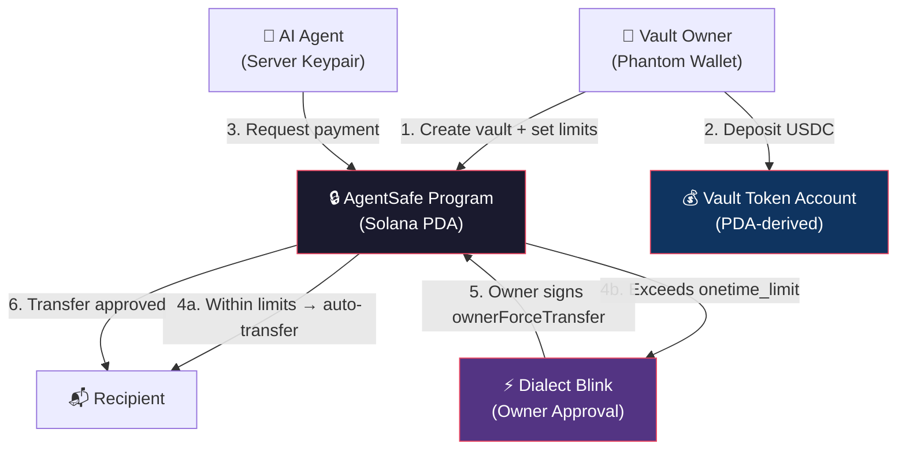

# AgentSafe

> _An On-Chain Policy Vault & Security Layer for Autonomous AI Agents on Solana._

🔴 **Demo Video (YouTube):** [Watch the 3-minute demo](https://youtube.com)  
🌐 **Live DApp:** [agentsafe.vercel.app](https://agent-safe.vercel.app/)  
📜 **Devnet Program ID:** `B6SpUd172qVcLhVfdQCrZLk3zpsuYkJ4ZYtCaoL2Dr2d`

---

## 🚨 The Problem

Autonomous AI agents are increasingly being used to perform real financial operations — payments, subscriptions, API purchases. But giving an agent direct access to a private key is a gamble with catastrophic downside:

- **LLM hallucinations** can fabricate payment details, sending funds to nonexistent or incorrect recipients.
- **Prompt injection** attacks can hijack an agent into draining an entire wallet in a single transaction.
- **Secret leakage** — the agent's backend may inadvertently expose private keys to third-party services, logs, or tool outputs.
- **Web2 guardrails are bypassable.** Rate limits and backend validation logic can be circumvented. Spending rules must be enforced at a level the agent cannot tamper with — the blockchain itself.

> Giving an AI agent a private key is giving it a blank check. AgentSafe gives it a policy-controlled spending allowance instead.

---

## 🛡️ The Solution: AgentSafe

AgentSafe is not a wallet. It is a **Policy Engine** implemented as a Solana smart contract.

The vault owner deposits funds into a program-derived account (PDA) and assigns an agent wallet with strict, on-chain spending limits — daily, hourly, and per-transaction. The agent can autonomously execute payments **only within those limits**. Any request that exceeds the one-time limit is automatically escalated to manual owner approval via a Solana Action (Blink) — no context-switching, no separate app.



---

## ✨ Key Features & User Experience

### 1. On-Chain Policy Enforcement

The Solana program enforces three independent spending limits — **daily**, **hourly**, and **per-transaction** — directly in Rust. Limits use epoch-aligned lazy resets (day = `unix_timestamp / 86400`, hour = `unix_timestamp / 3600`), so counters reset automatically without cron jobs. The agent's keypair physically cannot call `update_vault` or `owner_force_transfer` — those instructions require the owner's signature. No loopholes, no workarounds.

### 2. Solana Actions (Blinks) Override

When the agent requests a payment that exceeds `onetime_limit`, it cannot execute the transaction. Instead, the chat renders a real **Dialect Blink** card with an "Approve Transfer" button. The owner signs an `ownerForceTransfer` instruction directly from Phantom — a one-click Action UX without leaving the chat. Payments within limits are auto-executed by the server-side agent, invisible to the user.

Dynamic OG images are generated per Blink using `@vercel/og` (Satori), showing live vault policy state — daily/hourly usage bars, one-time cap, recipient, and amount — fetched directly from on-chain data at render time.

### 3. Hot / Cold Separation

The architecture enforces a strict separation of concerns:

|                  | Hot Contour (Agent)                     | Cold Contour (Owner)                                                    |
| ---------------- | --------------------------------------- | ----------------------------------------------------------------------- |
| **Key type**     | Server keypair (`AGENT_SECRET_KEY`)     | Phantom / hardware wallet                                               |
| **Can do**       | `execute_payment` within limits         | `initialize`, `update_vault`, `owner_force_transfer`, deposit, withdraw |
| **Cannot do**    | Change limits, force-transfer, withdraw | — (full authority)                                                      |
| **Risk profile** | Limited blast radius                    | Full custody, cold storage                                              |

Even if the agent's server keypair is fully compromised, the attacker can only spend up to the remaining daily/hourly limit. They cannot change the policy, withdraw the vault balance, or escalate permissions.

---

## 🛠️ Under the Hood

### Smart Contract (Anchor / Rust)

|                     |                                                                                                                   |
| ------------------- | ----------------------------------------------------------------------------------------------------------------- |
| **Framework**       | Anchor 1.0.2, `anchor-lang` + `anchor-spl`                                                                        |
| **Vault State**     | PDA seeded by `["vault", owner, token_mint]`                                                                      |
| **Token Account**   | Derived PDA seeded by `["token_vault", vault_state]`                                                              |
| **Token Interface** | `TokenInterface` — supports both SPL-Token and SPL-Token-2022                                                     |
| **Instructions**    | `initialize`, `execute_payment`, `owner_force_transfer`, `update_value`                                           |
| **Error Codes**     | `DailyLimitExceeded`, `HourlyLimitExceeded`, `OnetimeLimitExceeded`, `MathOverflow`, `InvalidLimitsConfiguration` |
| **Arithmetic**      | All spending math uses `checked_add` to prevent overflow                                                          |
| **Tests**           | LiteSVM-based Rust tests + TypeScript Anchor tests                                                                |

### Backend (Next.js Serverless API)

|                   |                                                                                                                                                                                                                                                                                                                  |
| ----------------- | ---------------------------------------------------------------------------------------------------------------------------------------------------------------------------------------------------------------------------------------------------------------------------------------------------------------- |
| **Runtime**       | Next.js 16 App Router, serverless API routes                                                                                                                                                                                                                                                                     |
| **Chat Auth**     | Ed25519 signature verification via `@noble/curves/ed25519` — the owner signs a structured message (`AgentSafe Chat Auth\nOwner: ...\nTokenMint: ...\nIssuedAt: ...`) with their wallet; the server verifies the signature off-chain before processing any chat request. 1-hour TTL with 5s clock skew tolerance. |
| **Validation**    | Zod schemas for all API inputs — messages, execution context, auth payloads, tool arguments                                                                                                                                                                                                                      |
| **Rate Limiting** | Max 40 messages per request, 12K chars per message, 120K total chars                                                                                                                                                                                                                                             |

### Agent Orchestration

|                  |                                                                                                                                         |
| ---------------- | --------------------------------------------------------------------------------------------------------------------------------------- |
| **LLM**          | OpenRouter → `anthropic/claude-haiku-4.5`                                                                                               |
| **Tool Calling** | Function Calling with `execute_payment` tool (amount + recipient address)                                                               |
| **Loop**         | Up to 10 LLM iterations per chat completion                                                                                             |
| **Signing**      | Server-side agent keypair (`AGENT_SECRET_KEY`, base58-encoded) auto-signs `execute_payment` transactions within limits                  |
| **Escalation**   | If `amount > onetime_limit`, returns `requiresOwnerApproval: true` with `approvalType: "owner_force_transfer"` → Blink rendered in chat |

### Frontend

|                |                                                                           |
| -------------- | ------------------------------------------------------------------------- |
| **Framework**  | React 19, Next.js 16 App Router                                           |
| **Wallet**     | `@solana/wallet-adapter-react` (Phantom + optional Burner wallet for dev) |
| **Blinks**     | `@dialectlabs/blinks` for rendering Blink cards inline in the chat        |
| **OG Images**  | `@vercel/og` (Satori) for dynamic policy-check images on Blink cards      |
| **Typography** | Geist (sans) + IBM Plex Mono                                              |
| **State**      | All client state in `localStorage` — no server-side database              |
| **Audit Log**  | Client-side event log (localStorage), capped at 100 entries per vault     |

---

## 🏗️ Future Architecture & Scope

The current Next.js application serves as a **Reference Client** to demonstrate the underlying on-chain policy engine. Future development of the AgentSafe protocol could explore the following architectural expansions:

### 1. Agent Framework SDKs

Instead of relying on custom API routes, the goal is to develop standardized SDK adapters for popular AI orchestration frameworks (such as OpenClaw, LangChain, or Hermes). This would allow developers to integrate on-chain security as a drop-in tool for their autonomous agents:
`from agentsafe import PaymentTool`

### 2. Extended Policy Rules

Expanding the Rust program to support more granular and dynamic constraints:

- **Recipient Whitelisting:** Strict on-chain enforcement of allowed destination addresses.
- **Recurring Subscriptions:** Logic to support automated time-based streaming payments.
- **Oracle Integration:** Using price feeds (e.g., Pyth / Switchboard) to enforce spending limits based on real-time USD equivalents rather than raw token amounts.

### 3. Pre-flight Agent Introspection

Developing lightweight endpoints and on-chain query helpers that allow AI agents to check their remaining limits _before_ attempting to construct and broadcast a transaction. This optimizes gas fees, rate limits, and LLM token usage by preventing guaranteed failures.

---

## 💻 Running Locally

### Prerequisites

- **Node.js** ≥ 18
- **Rust** (stable toolchain)
- **Solana CLI** (`solana`, `solana-keygen`, `spl-token`)
- **Anchor CLI** ≥ 1.0.2

### Quick Start

```bash
# 1. Clone the repository
git clone https://github.com/0xNaezo/AgentSafe.git && cd AgentSafe

# 2. Install frontend dependencies
cd web && npm install && cd ..

# 3. Build and deploy the program (devnet or localnet)
cd anchor_program
anchor build
anchor deploy --provider.cluster devnet  # or: anchor deploy (for localnet)
cd ..

# 4. Create web/.env.local with required variables:
cat > web/.env.local << 'EOF'
NEXT_PUBLIC_SOLANA_RPC_URL=<your_rpc_url>
NEXT_PUBLIC_DEMO_TOKEN_MINT=<fake_usdc_mint_address>
AGENT_SECRET_KEY=<base58_agent_keypair>
OPENROUTER_API_KEY=<your_openrouter_key>
EOF

# 5. Start the frontend
cd web && npm run dev
```

### Alternative: Full Localnet Setup Script

For a complete local development environment (local validator + fake USDC mint + funded wallets):

```bash
# 1. Copy and configure environment
cp .env.example .env
# Edit .env — set PHANTOM_WALLET to your wallet's public key

# 2. Start a local Solana validator (in a separate terminal)
solana-test-validator

# 3. Run the setup script (builds program, creates token, funds wallets)
bash scripts/setup_localnet.sh

# 4. Start the frontend
cd web && npm run dev
```

The setup script will:

- Airdrop SOL to your CLI wallet and Phantom wallet
- Build and deploy the Anchor program to localnet
- Create a Fake USDC mint with 6 decimals
- Mint test tokens to your wallet
- Auto-configure `web/.env.local` with the correct RPC URL and mint address

### Environment Variables Reference

| Variable                           | Required | Description                                                        |
| ---------------------------------- | -------- | ------------------------------------------------------------------ |
| `NEXT_PUBLIC_SOLANA_RPC_URL`       | ✅       | Solana RPC endpoint (localnet/devnet)                              |
| `NEXT_PUBLIC_DEMO_TOKEN_MINT`      | ✅       | Public key of the demo USDC token mint                             |
| `AGENT_SECRET_KEY`                 | ✅       | Base58-encoded secret key for the agent's server keypair           |
| `OPENROUTER_API_KEY`               | ✅       | API key for OpenRouter (powers Claude Haiku in agent chat)         |
| `NEXT_PUBLIC_AGENTSAFE_PROGRAM_ID` | ❌       | Override program ID (defaults to IDL address)                      |
| `NEXT_PUBLIC_ENABLE_BURNER_WALLET` | ❌       | Set to `"true"` to enable the unsafe burner wallet adapter for dev |
| `OPENROUTER_TIMEOUT_MS`            | ❌       | LLM request timeout in ms (default: 30000)                         |

---

## 📂 Repository Structure

```
agentsafe/
├── anchor_program/           # Solana smart contract
│   ├── programs/
│   │   └── anchor_program/
│   │       └── src/
│   │           ├── lib.rs                # Program entry point, declare_id!
│   │           ├── state.rs              # Vault account struct
│   │           ├── error.rs              # Custom error codes
│   │           ├── constants.rs          # PDA seeds, time constants
│   │           └── instructions/
│   │               ├── initialize.rs         # Create vault + token account
│   │               ├── execute_payment.rs    # Agent payment with limit checks
│   │               ├── owner_force_transfer.rs  # Owner bypass (Blinks)
│   │               └── update_vault.rs       # Update spending limits
│   └── tests/                # TypeScript integration tests
│       └── anchor_program.ts
│
├── web/                      # Next.js frontend + API
│   ├── app/
│   │   ├── page.tsx              # Dashboard (balance, limits, deposit/withdraw)
│   │   ├── vault-setup/          # Create new vault
│   │   ├── vault-settings/       # Edit vault limits
│   │   ├── agent-chat/           # AI chat with Claude Haiku
│   │   ├── vault-metadata/       # Raw vault state viewer
│   │   ├── audit/                # Full audit log
│   │   ├── blinks/               # Solana Actions endpoint + Dialect Blink renderer
│   │   │   ├── route.ts          # GET (action metadata) + POST (ownerForceTransfer tx)
│   │   │   ├── render.tsx        # Client-side Blink component
│   │   │   └── og/route.tsx      # Dynamic OG image generation (Satori)
│   │   ├── api/
│   │   │   ├── chat/             # Chat completions API (auth + LLM loop)
│   │   │   └── test-tokens/      # Faucet for dev/demo tokens
│   │   └── components/           # Shared UI components
│   │
│   └── lib/
│       ├── agent/                # Server-side agent keypair + payment execution
│       ├── chat/                 # LLM orchestration (OpenRouter, tools, schemas)
│       ├── solana/               # PDA derivation, vault helpers, config, IDL
│       └── audit-log.ts          # Client-side audit log (localStorage)
│
├── scripts/
│   └── setup_localnet.sh     # One-command localnet bootstrap
│
└── .env.example              # Environment template
```

---

## 📄 License

[MIT](./LICENSE) © 2026 Naezo
